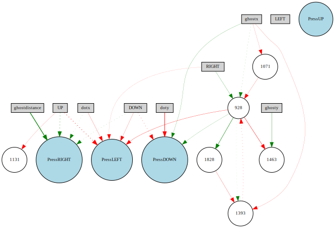

# PacmanEvolution
Repo for my Pacman NEAT training pet project. It can be found in the `/PacmanEvolution` folder.

# Disclaimer
This repo is not in active development. I started this pet project at the start of 2019. I stopped developing it because I was just interested how neuro-evolution would perform on the Pacman course for which we'd been manually crafting agents.

I already expected that more sophisticated Reinforcement Learning methods were needed like Deep-Q learning for this problem. That hunch turned out to be true as the results on maze-like maps were kind of lackluster. But it does perform well on the small maps where it needs to find pellets, and sometimes on the small maps where it needs to avoid ghosts!

In the code there are a lot of variables that have to manually be changed, I would have made them all passable as arguments if I planned to actually release the code but I'm not planning to do this anymore in pursuits of more interesting and sophisticated RL problems. 

# Training
To start training simply run `train.py`.

(It seems like I've also been working on `paralleltrain.py` but that doesn't work as of right now)

# Validation
The models are saved automatically every generation with the name of the layout in the filename. These models can be found in `/bestGenome`.

Change the variable `genomeFile` in `runmodel.py` and run it to execute the model and see how it performs.

# Visualization
It's possible to visualize the trained model (to see the topology of the network and the sign of the weights) by running `visualizegenome.py` with your desired `genomeFile` in the code.

Example of a network that didn't learn that well:

(Currently can't run it because I don't remember which testing package visualize needs to be imported from. I believe this is most likely from an old Neat-Python version.)

# Acknowledgements
Pacman environment provided originally by [UC Berkeley](http://ai.berkeley.edu/project_overview.html) and adapted by the Radboud University (code from AI B: Practical 2018-2019).

NEAT inspiration provided by [Siraj](https://github.com/llSourcell/neuroevolution-for-flappy-birds) (can be found in the FlappyInspiration folder) who adapted it from the original author [rsk237](https://github.com/rsk2327/NEAT_FlappyBird).

Several other (adapted) code snippets and config files are taken from the [Python-NEAT documentation](https://neat-python.readthedocs.io/en/latest/).
